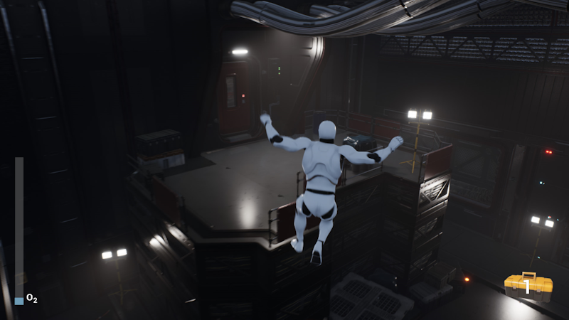

# Spaceship

## About

Spaceship is a **third-person platformer** game prototype where the player have to reach the server room to fix the **depleting oxygen** situation. The player can move quite freely while looking for a way through the level. There are two types of **pickup items**. The oxygen bottles that fill the oxygen bar which decreases over time. The second one are the toolboxes which increase the **player score**. The game ends when the player is out of oxygen or reaches the server room.

You can **download for Windows** by clicking [here](https://m-biernat.itch.io/spaceship).

## Tools & Dependencies

 - Unreal Engine 4.25 - game engine (used Blueprints for programming).

Project requires these assets:
 - [Advanced Locomotion System V4](https://www.unrealengine.com/marketplace/en-US/product/advanced-locomotion-system-v1),
 - [Modular Scifi Season 2 Starter Bundle](https://www.unrealengine.com/marketplace/en-US/product/modular-scifi-season-2-starter-bundle).

## Credits

 - **Michał Biernat** @[m-biernat](https://github.com/m-biernat) - game designer, programmer;
 - **Anna Hosumbek** @[An-Hos](https://github.com/An-Hos) - level designer.

BGM and SFX are from [Freesound.org](https://freesound.org/), licensed under [CC0](https://creativecommons.org/publicdomain/zero/1.0/).

## License

All rights reserved ([no license](https://choosealicense.com/no-permission/)):
 - You **can** view (peek into the code and assets) and fork this repository;
 - You **cannot** reproduce, distribute, or create derivative works;
 - You **can** play the game (*"Spaceship"*) free of charge via the provided channels.
